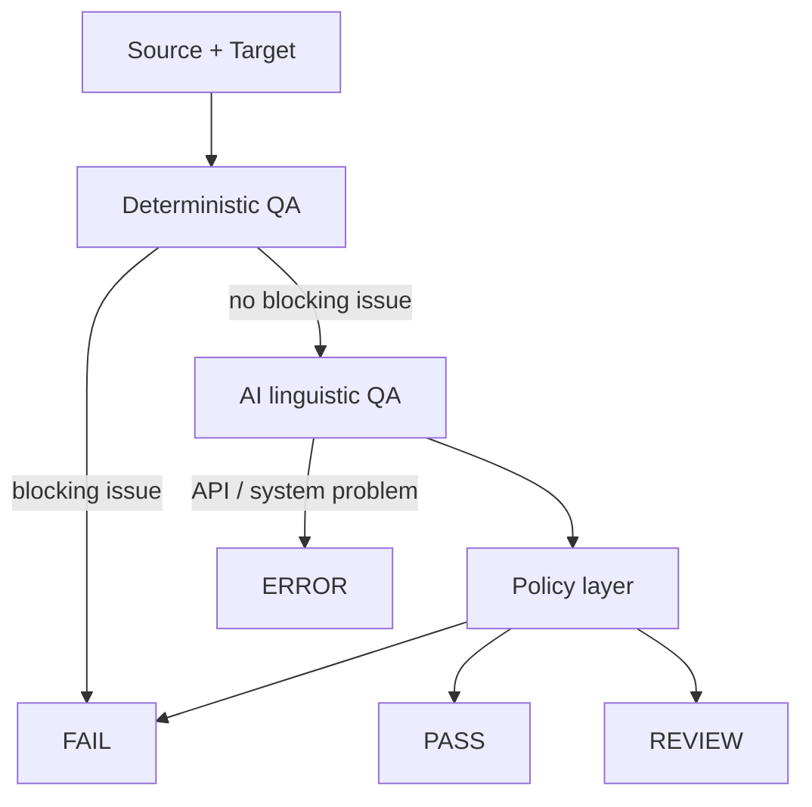

# Globalization Workflow Lab

Small localisation QA prototype for en-US → it-IT.

It combines:

- deterministic QA for objective issues
- AI for linguistic evaluation
- a policy layer for the final decision

The goal is to test whether a hybrid approach can catch both technical and linguistic localisation problems.

## How it works



Deterministic checks cover missing keys, placeholders, terminology, protected terms, untranslated strings, translation-memory consistency and length.

Missing keys, placeholders, terminology, protected terms and untranslated strings are blocking. If one of them fails, the string is marked FAIL and the AI is not called.

Translation-memory and length checks only produce warnings. They stay in the report but never block on their own.

AI evaluation looks at:

- accuracy
- fluency
- style

The AI does not make the final decision directly. A separate policy layer converts the evaluation into PASS, REVIEW or FAIL.

## Providers

The project supports:

- OpenAI
- Anthropic Claude
- Ollama

API keys are stored in `.env` and are not committed to Git.

## Run

Install dependencies:

```bash
npm install
```

Run deterministic QA:

```bash
npm run qa
```

Run hybrid QA:

```bash
npm run qa:hybrid:openai
npm run qa:hybrid:claude
npm run qa:hybrid:ollama
```

Run the AI benchmark:

```bash
npm run benchmark:ai:openai
npm run benchmark:ai:claude
npm run benchmark:ai:ollama
```

## Initial benchmark

The AI benchmark currently contains 5 manually labelled linguistic QA cases.

| Model  | Correct |
| ------ | ------- |
| OpenAI | 5/5     |
| Claude | 5/5     |
| Ollama | 2/5     |

This is a small test set, so the results should not be treated as general model accuracy.

The benchmark is also being used to compare model latency and API cost.
