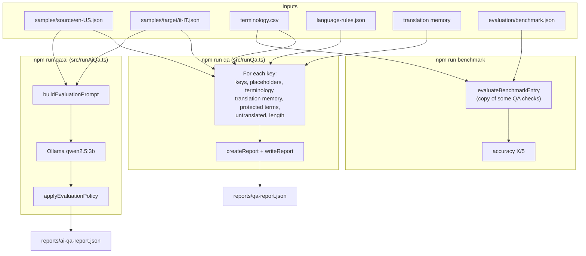

# Project Structure

This project checks Italian translations (`it-IT`) of English UI strings (`en-US`).
There are two kinds of checks:

- **Deterministic QA**: fixed rules (placeholders, glossary terms, product names, and more).
- **AI QA**: a local model (Ollama, `qwen2.5:3b`) scores meaning, fluency, and style.

## Folders

```
globalization-workflow-lab/
├── .github/workflows/
│   └── localization-qa.yml        CI: runs QA + benchmark, uploads the report
│
├── samples/
│   ├── source/en-US.json          English strings (the source)
│   └── target/it-IT.json          Italian strings (the translation to check)
│
├── language-assets/
│   ├── it-IT/
│   │   ├── language-rules.json    protected terms + max length ratio
│   │   ├── terminology.csv        approved glossary (English → Italian)
│   │   └── style-guide.md         style guide for people (not read by code)
│   └── translation-memory/
│       └── en-US_it-IT.json       past approved translations
│
├── evaluation/
│   └── benchmark.json             test cases with the expected result
│
├── src/
│   ├── runQa.ts                   start of deterministic QA   (npm run qa)
│   ├── runAiQa.ts                 start of AI QA              (npm run qa:ai)
│   ├── index.ts                   leftover: prints the glossary
│   │
│   ├── qa/                        deterministic checks
│   │   ├── checkKeys.ts               missing / extra keys
│   │   ├── placeholders.ts            finds {placeholders}
│   │   ├── comparePlaceholders.ts     missing / extra placeholders
│   │   ├── terminology.ts             loads terminology.csv
│   │   ├── checkTerminology.ts        approved glossary terms used?
│   │   ├── checkProtectedTerms.ts     product names unchanged?
│   │   ├── checkUntranslated.ts       target same as source?
│   │   ├── checkLength.ts             target too long?
│   │   ├── translationMemory.ts       loads translation memory
│   │   ├── findTranslationMemoryMatch.ts  finds an exact memory match
│   │   ├── checkTranslationMemory.ts  target differs from memory?
│   │   ├── createReport.ts            builds the report + summary
│   │   └── writeReport.ts             saves the report as JSON
│   │
│   ├── ai/                        AI evaluation
│   │   ├── ollamaClient.ts            calls Ollama on localhost:11434
│   │   ├── buildEvaluationPrompt.ts   writes the prompt for the model
│   │   ├── evaluateTranslation.ts     prompt → model → JSON scores
│   │   ├── applyEvaluationPolicy.ts   scores → pass / review / fail
│   │   ├── evaluateAndDecide.ts       runs evaluate + policy together
│   │   └── types.ts                   AI score and decision types
│   │
│   ├── evaluation/                benchmark               (npm run benchmark)
│   │   ├── benchmark.ts               loads benchmark.json
│   │   ├── evaluateBenchmarkEntry.ts  runs the checks on one case
│   │   └── runBenchmark.ts            runs all cases, prints accuracy
│   │
│   ├── types/
│   │   ├── qaReport.ts                shape of qa-report.json
│   │   └── aiQaReport.ts              shape of ai-qa-report.json
│   │
│   └── test*.ts                   manual scripts that only print output
│
└── reports/                       created when run (ignored by git)
    ├── qa-report.json
    └── ai-qa-report.json
```

## How it runs



## Commands

| Command | What it does | Used in CI |
|---|---|---|
| `npm run qa` | Deterministic QA, writes `reports/qa-report.json` | Yes |
| `npm run benchmark` | Checks if the QA rules find the expected problems | Yes |
| `npm run qa:ai` | AI QA, needs Ollama running on your machine | No |
| `npm run qa:full` | `qa`, then `qa:ai` (AI runs only if `qa` passes) | No |

## Deterministic checks

| Check | Result if it finds a problem |
|---|---|
| Missing key | fail |
| Extra key in target | warn |
| Missing or extra placeholder | fail |
| Glossary term not used | fail |
| Protected term changed | fail |
| Target same as source | fail (unless it is only a protected term) |
| Different from translation memory | warn |
| Target too long (over `maxLengthRatio`) | warn |

Any **fail** makes `npm run qa` exit with code 1, so CI fails.

## AI decision rules

`applyEvaluationPolicy.ts` decides, not the model:

| Rule | Decision |
|---|---|
| accuracy ≤ 2 | fail |
| accuracy = 3 | review |
| confidence < 0.8 | review |
| fluency ≤ 2 or style ≤ 2 | review |
| otherwise | pass |

Any **review** or **fail** makes `npm run qa:ai` exit with code 1.
